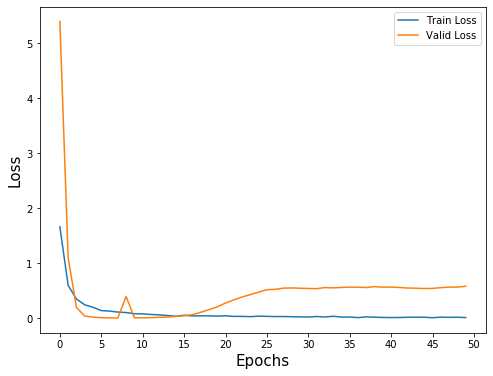
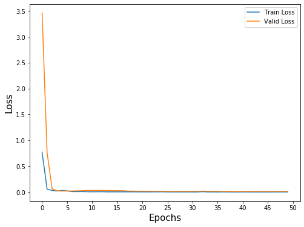

```python
import pandas as pd
import numpy as np
import matplotlib.pyplot as plt

from sklearn.model_selection import train_test_split

import tensorflow as tf
from tensorflow import keras
from tensorflow.keras import layers

from keras.models import load_model
```


```python
data = pd.read_csv('data/digits/data.csv')

y = data.iloc[:, 0]
x = data.iloc[:, 1:]

X_train, X_test, y_train, y_test = train_test_split(x, y, test_size=.2)

X_train.shape, X_test.shape, y_train.shape, y_test.shape
```


    ((777, 1764), (195, 1764), (777,), (195,))


### Train a Dense Model


```python
model = keras.Sequential()

model.add(layers.Input(shape=(X_train.shape[1])))

model.add(layers.Dense(1024, activation='relu'))
model.add(layers.BatchNormalization())
model.add(layers.Dropout(.5))
model.add(layers.Dense(512, activation='relu'))
model.add(layers.BatchNormalization())
model.add(layers.Dropout(.5))
model.add(layers.Dense(10, activation='softmax'))

model.compile(
    loss=tf.keras.losses.sparse_categorical_crossentropy,
    optimizer=tf.keras.optimizers.SGD(0.001),
)

history = model.fit(X_train, y_train, epochs=50, batch_size=16, validation_data=(X_test, y_test), verbose=0)
```


```python
plt.figure(figsize=(8,6))

plt.plot(history.history['loss'], label='Train Loss')
plt.plot(history.history['val_loss'], label='Valid Loss')

plt.xlabel('Epochs', size=15)
plt.ylabel('Loss', size=15)

plt.legend()

plt.xticks(np.arange(55)[::5], np.arange(55)[::5])

plt.show()
```





```python
pred = model.predict(X_test)
pred = pred.argmax(-1).flatten()

print('Accuracy : {:.4f}'.format((y_test == pred).sum() / pred.shape[0]))
```

    Accuracy : 0.9897


### Train a Convolutional Model


```python
data = pd.read_csv('data/digits/data.csv')

y = data.iloc[:, 0]
x = data.iloc[:, 1:]
x = x.values.reshape((-1, 42, 42, 1))

X_train, X_test, y_train, y_test = train_test_split(x, y, test_size=.2)

model = keras.Sequential()

model.add(layers.Input(shape=(42, 42, 1)))

model.add(layers.Conv2D(64, (3, 3), 1, 'same', activation='relu'))
model.add(layers.MaxPooling2D())
model.add(layers.BatchNormalization())
model.add(layers.Dropout(.5))

model.add(layers.Conv2D(512, (3, 3), 1, 'same', activation='relu'))
model.add(layers.MaxPooling2D())
model.add(layers.BatchNormalization())
model.add(layers.Dropout(.5))

model.add(layers.Flatten())

model.add(layers.Dense(10, activation='softmax'))

model.compile(
    loss=tf.keras.losses.sparse_categorical_crossentropy,
    optimizer=tf.keras.optimizers.SGD(0.001),
)

history = model.fit(X_train, y_train, epochs=50, batch_size=16, validation_data=(X_test, y_test), verbose=0)
```


```python
plt.figure(figsize=(8,6))

plt.plot(history.history['loss'], label='Train Loss')
plt.plot(history.history['val_loss'], label='Valid Loss')

plt.xlabel('Epochs', size=15)
plt.ylabel('Loss', size=15)

plt.legend()

plt.xticks(np.arange(55)[::5], np.arange(55)[::5])

plt.show()
```





```python
pred = model.predict(X_test)
pred = pred.argmax(-1).flatten()

print('Accuracy : {:.4f}'.format((y_test == pred).sum() / pred.shape[0]))
```

    Accuracy : 1.0000


```python
# model.save('models/digit')
```
