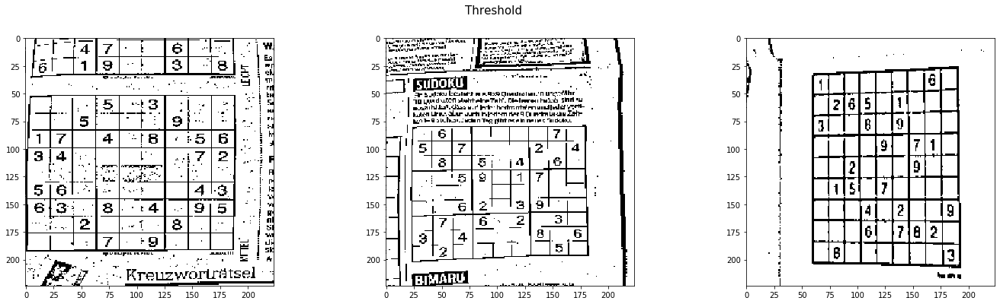
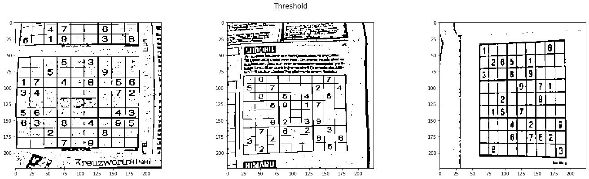

```python
import cv2
import matplotlib.pyplot as plt
import os
import subprocess
import numpy as np
```

Randomly select three images to display


```python
imgs = [img for img in os.listdir('data') if '.jpg' in img]

# Read in images
imgs = [plt.imread(f'data/{img}') for img in imgs]
# Resize Images
imgs = [cv2.resize(img, (224, 224)) for img in imgs]
# To Grayscale
imgs = [cv2.cvtColor(img, cv2.COLOR_RGB2GRAY) for img in imgs]
```


```python
def plot_images(imgs, title=None, cmap='gray', save_image=False, image_name=None):
    
    fig, ax = plt.subplots(1, 3, figsize=(24, 6))
    
    if title:
        fig.suptitle(title, size=15)

    ax[0].imshow(imgs[0], cmap=cmap)
    ax[1].imshow(imgs[1], cmap=cmap)
    ax[2].imshow(imgs[2], cmap=cmap)

    if save_image:
        if image_name is None:
            raise('Provide an image name')
        else:
            fig.savefig(f'plots/{image_name}')
    
    plt.show()
```


```python
random_idx = np.random.choice(np.arange(len(imgs)), 3)
idx = [24, 25, 195]
random_imgs = [imgs[i] for i in idx]

plot_images(random_imgs)
```


Apply Threshold


```python
def apply_thres(imgs, block_size, c, blur=True, otsu=True, blur_sigma=0):
    
    if blur and not otsu:
        imgs = [cv2.GaussianBlur(img,(5,5),blur_sigma) for img in imgs]
        
    elif otsu and not blur:
        
        imgs = [cv2.threshold(img,0,255,cv2.THRESH_OTSU) for img in imgs]
        imgs = [x[1] for x in imgs]
        
    elif otsu and blur:
        
        imgs = [cv2.GaussianBlur(img,(5,5),blur_sigma) for img in imgs]
        imgs = [cv2.threshold(img,0,255,cv2.THRESH_BINARY+cv2.THRESH_OTSU)for img in imgs]
        imgs = [img[1] for img in imgs]
    
    if not blur and not otsu:
        imgs = [cv2.adaptiveThreshold(img,200,cv2.ADAPTIVE_THRESH_GAUSSIAN_C, cv2.THRESH_BINARY, block_size, c) for img in imgs]
    
    
    return imgs
```


```python
block_size = 15
c = 9

ob_imgs = apply_thres(random_imgs, block_size, c)
otsu_imgs = apply_thres(random_imgs, block_size, c, blur=False)
blur_imgs = apply_thres(random_imgs, block_size, c, otsu=False)
th_imgs = apply_thres(random_imgs, block_size, c, blur=False, otsu=False)


plot_images(ob_imgs, 'Otsu_Blurred Threshold')
plot_images(otsu_imgs, 'Otsu Threshold')
plot_images(blur_imgs, 'Blurred Threshold')
plot_images(th_imgs, 'Threshold')
```





Choosing Otsu Images

Smooth images


```python
def apply_opening(imgs, kernel_size=(3,3), iterations=1):
    
    kernel = np.ones(kernel_size, np.uint8)
    imgs = [cv2.morphologyEx(img, cv2.MORPH_OPEN, kernel, iterations=iterations) for img in imgs]
    
    return imgs
```


```python
kernel_size = (2,2)
iterations = 1

open_otsu_imgs = apply_opening(otsu_imgs, kernel_size, iterations)
open_blur_imgs = apply_opening(blur_imgs, kernel_size, iterations)
open_ob_imgs = apply_opening(ob_imgs, kernel_size, iterations)
open_th_imgs = apply_opening(th_imgs, kernel_size, iterations)

plot_images(open_otsu_imgs, 'Otsu')
plot_images(open_ob_imgs, 'Otsu Blurred')
plot_images(open_th_imgs, 'Threshold')
plot_images(open_blur_imgs, 'Blurred')
```





```python
def find_boxes(imgs):
    
    contours = [cv2.findContours(img, cv2.RETR_CCOMP, cv2.CHAIN_APPROX_SIMPLE)[0] for img in imgs]
    boxes = []

    for i in range(3):
        box = []
        for contour in contours[i]:

            rect = cv2.boundingRect(contour)
            area = rect[2] * rect[3]

            # There are cases box encircles the whole image.
            # Skip those boxes
#             if area < 200*200:
            box.append((rect, area))

        # Sort by area in decreasing order
        box.sort(key=lambda x:x[1], reverse=True)
        boxes.append(box)
        
    return boxes


def draw_boxes(imgs, boxes, alpha=.9, num_boxes=1):
    
    # Make the bounding box transparent
    alpha = .9

    boxes_imgs = []

    for i, img in enumerate(imgs):

        temp_img = img.copy()
        for box in boxes[i][:num_boxes]:
#         box = boxes[i][0]

            x, y, w, h = box[0]

            temp_img = cv2.rectangle(temp_img, (x, y), (x+w, y+h), 255, 5)

        temp_img = cv2.addWeighted(temp_img, alpha, img, 1-alpha, 0)
        boxes_imgs.append(temp_img)
        
    return boxes_imgs
```


```python
otsu_boxes = find_boxes(open_otsu_imgs)
otsu_boxed_imgs = draw_boxes(open_otsu_imgs, otsu_boxes)

ob_boxes = find_boxes(open_ob_imgs)
ob_boxed_imgs = draw_boxes(open_ob_imgs, ob_boxes)

th_boxes = find_boxes(open_th_imgs)
th_boxed_imgs = draw_boxes(open_th_imgs, th_boxes)

plot_images(otsu_boxed_imgs, cmap=None, title='otsu', save_image=True, image_name='otsu_boxed.png')
plot_images(ob_boxed_imgs, cmap=None, title='otsu blur', save_image=True, image_name='ob_boxed.png')
plot_images(th_boxed_imgs, cmap=None, title='threshold', save_image=True, image_name='th_boxed.png')
```


```python

```


```python

```
